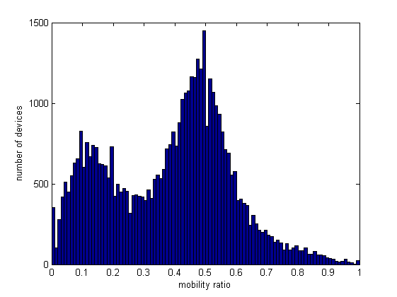
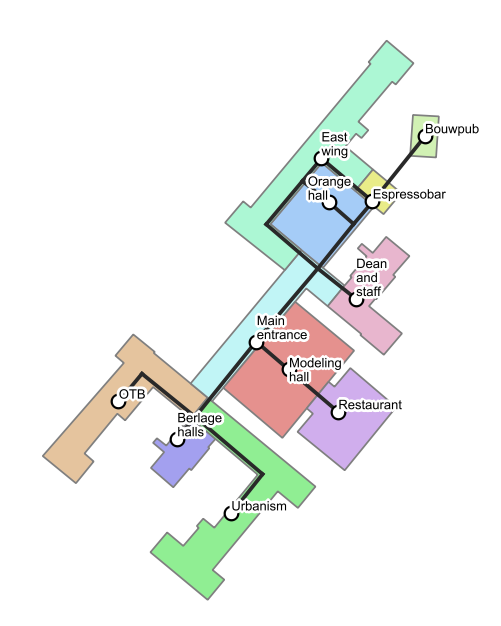

## Contents
{:.no_toc}

* Contents
{:toc}

In this section the data mining methods used to retrieve movement
patterns from the Wi-Fi log at two different spatial levels will be
described. Figure 1 gives an overview of the main workflow, starting with the TU
Delft eduroam Wi-Fi log and ending with movement patterns. The two
spatial levels for which movement patterns will be derived are
’building’ and ’building-part’ level. The movement patterns on building
level concern the movement from, to and between the buildings on the
campus. The movement patterns on building-part level concern the
movement from, to and between building-parts of the faculty of
Architecture and the Built Environment. First subsection [Mobile device extraction](#mobile-device-extraction) will describe the
extraction of mobile devices. The reason that mobile devices are
extracted is that the records of mobile devices (e.g. smart phones) are
more complete and representative for the actual movement of the
corresponding person then records of static devices (e.g. laptops). Subsection [Preprocessing raw Wi-Fi log sessions](#preprocessing-raw-wi-fi-log-sessions) will
describe how the raw data of the Wi-Fi log is preprocessed to retrieve
clean sessions for both building and building-part level. A session is
defined as time interval during which a device is connected to one
access point (AP). In subsection [State extraction](#state-extraction) it will be explained how states are created by
grouping subsequent sessions that share the same location. A state is
defined as a time interval during which a device is located in a certain
building or building-part. A key part in the process of state extraction
is the creation of a ’world’ state which allows the detection of
movement from and to campus. Subsection [Movement extraction](#movement-extraction) addresses how the resulting states are used
to retrieve movements at both spatial levels. A movement is defined by
the change from one state to the next subsequent state, where the
different states must be at a different locations. Finally subsecton [Movement pattern extraction](#movement-pattern-extraction) describes how
the movements are used to derive and visualize movement patterns.

{: style="text-align: center;"}

*Figure 1: Workflow*
{: style="color:gray; font-size: 80%; text-align: center;"}

## Mobile device extraction

The Wi-Fi log contains data of different device types, as any device
that makes a connection to eduroam will be stored in the log. A
distinction can be made between mobile and static devices. Mobile
devices, such as smart phones, are usually switched on during the entire
day and are usually carried by the user. Static devices, such as
laptops, are mostly only switched on during particular periods when a
person is stationary for a longer period of time. Furthermore, they are
likely to be left by the user for certain time periods. Therefore, the
tracking of mobile devices gives more accurate information about the
patterns of users than the tracking of static devices. As a result a
distinction should be made between the two device types, so that static
devices can be filtered out. This distinction can be made based on the
knowledge that mobile device are more likely to have very short sessions
in the log as they continuously connect to new APs when a person moves
around. As a result the mobility of a device can be defined by the ratio
between the amount of short, 5 minute, sessions in the Wi-Fi log and the
total amount of sessions in the Wi-Fi log.

$$
\begin{align*}
Mobility\ ratio = \frac{number\ of\ short\ sessions}{total\ number\ of\ sessions}
\end{align*}
$$

Figure 2 shows a histogram of the mobility ratio of all devices. The two
distinctive peaks corresponding to the static and mobile devices can
clearly be identified. The mobility ration of all devices is stored in a
separate table, enabling filtering out of static devices at any point
during the process.

{: style="text-align: center;"}

*Figure 2: Histogram of mobility ratio of all devices in the Wi-Fi log.*
{: style="color:gray; font-size: 80%; text-align: center;"}

## Preprocessing raw Wi-Fi log sessions

For each session in the Wi-Fi log the name of the access point is
stored. By linking this name to a location the data becomes valuable for
detecting movement patterns. For some APs however the location is
unknown, these are filtered out. The other records are related to a
location, both on building and on building-part level. For building
level the location can easily be retrieved as the building ID is part of
the AP name. These IDs are linked to the corresponding building polygons
of a topographical map. The location of each building is the center
point of these polygons. For the Faculty of Architecture and the Built
Environment the floor plan with the locations of the different APs is
available. Building-parts (see Fig. 4) are defined based on the layout of the
APs. Each building-part contains several APs and the relation between
them is stored in the database. In this way the AP name can directly be
linked to a location.

## State extraction

To create states, subsequent sessions at the same location are grouped
together. As the location is known for each session on both building and
building-part level, states can be created for both spatial levels.
illustrates how sessions are grouped to create states. For grouping, a
time threshold of one hour is used, meaning that subsequent sessions
between which the time gap is less than one hour are grouped together.
The reason for the one hour threshold is that gaps smaller than an hour
are likely to represent a person that was just smoking or lunching
outside for a short period of disconnection. If a person is not recorded
for more than an hour it is more likely that the person has left the
campus. To be able to retrieve this movement away from and back to the
campus, ’world’ states are added to the data during a time period where
the person has not been recorded for more than one hour (see Fig. 3). Finally,
states are present in the data that do not represent real visits, but
only people passing by a building. These short states are filtered out
(see Fig. 3).

{: style="text-align: center;"}

*Figure 3: Processing steps; from raw data to movements.*
{: style="color:gray; font-size: 80%; text-align: center;"}

## Movement extraction

The extracted states contain implicit information on the movement of the
device. If a device is first located at location A and subsequently at
location B it must have moved from location A to B. However, in order to
be able to retrieve movement patterns, the movement should be stored
explicitly. The origin and destination of the movement are defined by
the locations of both states. The timing of the movement is derived by
taking the end time of each state minus 5 minutes and the start time of
the subsequent state (see Fig. 3). The reason for the 5 minute subtraction, is
that the last moment a device is actually recorded is 5 minutes before
the end time of a state.

## Movement pattern extraction

The final step is to extract movement patterns from the created
movements. These patterns can be derived by counting the amount of
movement from, to or between certain buildings and building-parts for
different time intervals. To determine if a movement should be counted
for a particular time interval, it is checked whether the time between
start and end falls within the interval. In this way each movement can
only be counted ones when comparing adjacent intervals. The amount
movement is both visualized in time profiles and maps with specified
time intervals. To visualize the indoor movement on a map, a network
graph of the underlying building floor plan is created for the Faculty
of Architecture and the Built Environment. For building level, no graph
is created as the movement in outdoor space is less constrained,
especially considering the spacious character of the TU Delft campus. To
determine the route taken from one building-part to another the shortest
path is taken using the Dijkstra algorithm.

{: style="text-align: center;"}

*Figure 4: Building parts on the ground floor of the Faculty of Architecture and the built environment and its underlying graph.*
{: style="color:gray; font-size: 80%; text-align: center;"}

