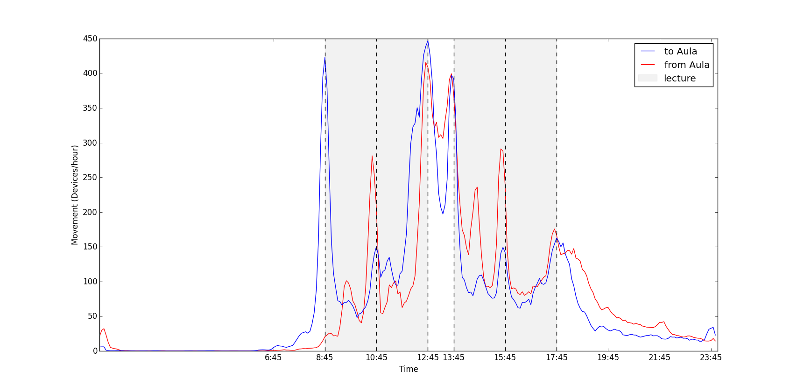

## Contents
{:.no_toc}

* Contents
{:toc}

First will give a brief analysis of the data, including some general
statistics. In the remainder of the chapter several movement patterns
retrieved from the raw Wi-Fi log will be presented. It should be noted
that many different movement patterns can be identified by counting the
movement for different time intervals and for different routes. This
paper aims at giving an overview of the different patterns that can be
extracted. will present the outdoor building level patterns, and the
indoor building-part level patterns.

## General statistics

Within the dataset 44.952 different users are present that together have
86.413 devices. Of these devices 24.156 are classified as mobile, the
remaining devices are either classified as static or had less than 100
sessions in the Wi-Fi log, which was decided to be insufficient for
classification. The 100 record threshold is a point of discussion,
currently it is based on the reasoning that a person that has less
records, is likely to be a visitor with access to eduroam, and not a
regular user of the TU Delft campus. shows the amount of data during the
different processing steps for both spatial levels. The reduction from
session to states is mainly due to the grouping. The reduction from
states to movements is mainly because the devices with less than 100
records are filtered out at this point.

{: style="text-align: center;"}

*Amount of data during processing stages*
{: style="color:gray; font-size: 80%; text-align: center;"}

## Outdoor movement patterns

Looking at building level, movement patterns between, from and to
buildings can be detected. shows the time profile of all movements with
and without the ‘world’ state. This graph shows that there is much
movement around 8.45, 12.45, 13.45, 15.45 and 17.45, corresponding with
lecture hours at TU Delft. With ‘world’ (blue line), the morning and
evening rush hours around 8.45 and 17.45 are detected, when students and
staff travel between campus and, probably, home. Without introducing the
‘world’ state (red line), these two movement peaks are not detected.

{: style="text-align: center;"}

*Time profile of indoor movement without world (only between building-parts) and with world (including movement from and to building part from ’world’.)*
{: style="color:gray; font-size: 80%; text-align: center;"}

illustrates the ten most occurring movements between buildings, on a
map, where buildings are represented as nodes, and edges represent the
number of movements. The number of movement, during the observation
period, is illustrated with colour and line width.

{: style="text-align: center;"}

*Top 10 most occuring movements on building level.*
{: style="color:gray; font-size: 80%; text-align: center;"}

In the movements of mobile (blue) and static (red) devices are shown.
The time profile of static devices, compared with lecture hours, is less
explicit than for mobile devices. This supports the assumption that
movement of static devices is less related to movement of people, than
mobile devices. Therefore, in this paper we only analyse movement of
mobile devices, to provide knowledge about human movement behaviour.

{: style="text-align: center;"}

*Time profile of all outdoor movement for static and mobile devices.*
{: style="color:gray; font-size: 80%; text-align: center;"}

The previous figures showed the movement over the entire time span of
the research. However, different movement patterns can be identified by
querying the data for certain time intervals. gives the time profiles of
the movement of mobile devices during weekdays and weekends for all
buildings including ’world’. Usually, most building at the TU Delft
Campus, except for the library, are closed during the weekend. This is
reflected by the amount of movement during the weekend. Moreover,
compared to weekdays, the number of movement is constant throughout the
day, as there are no lectures.

{: style="text-align: center;"}

*Time profile of all outdoor movement of mobile devices for week- and weekend days.*
{: style="color:gray; font-size: 80%; text-align: center;"}

Finally, the movement can also be queried based on origin and
destination instead of or together with time. This enables a more
detailed analysis of specific buildings or events. shows the movement
from and to the Aula during normal weekdays. The Aula has a lunch
facility, explaining the large amount of movement during lunch time.
Both the movement to and from the Aula is high at the start and the end
of the lunch time, because other facilities are located in the Aula as
well. gives insight in where people exactly come from and go to, during
the interval between 13:15 and 14:00. As expected, many people move to
the library at this time, probably to continue studying after lunch.

{: style="text-align: center;"}

*Time profile of movement of mobile devices from and to aula during normal weekdays.*
{: style="color:gray; font-size: 80%; text-align: center;"}

{: style="text-align: center;"}

*Movement of mobile devices from and to aula between 13:15 and 14:00 during normal weekdays.*
{: style="color:gray; font-size: 80%; text-align: center;"}

## Indoor movement patterns

Like for building level, the building-part level data can be filtered
for mobile devices and queried based on time, and origin and
destination. shows the time profiles for all movement on building-part
level for the Faculty of Architecture and the Built Environment. With
’world’ this includes the movement from and to the faculty, without
’world’ these movements are excluded. During the working day, the
movement is relatively steady, except for two distinct peaks before and
after lunch. Furthermore, small peaks can be seen at the start and end
of the day when people arrive and leave the building. The Faculty of
Architecture and the Built Environment normally closes at 22:00,
resulting in a movement peak captured in the graph.

{: style="text-align: center;"}

*Time profile of indoor movement without world (only between building-parts) and with world (including movement from and to building part from ’world’).*
{: style="color:gray; font-size: 80%; text-align: center;"}

shows all the movement within the Faculty of Architecture and the Built
Environment on a map. As the movements follow the shortest route on the
graph, it becomes possible to see which particular corridor or staircase
is busiest. Here the movement rates are highest in the eastern part of
the ground floor. This shows occupation of space by movement instead of
the flow between two states.

{: style="text-align: center;"}

*Map of all movement within the faculty of Architecture.*
{: style="color:gray; font-size: 80%; text-align: center;"}

Finally, and give a more detailed insight in the movement from and to
the Bouwpub (café) and canteen (lunch facility) building-parts. The time
profile of the canteen shows the expected peaks before and after lunch.
Simarly it can be seen that people move towards the bouwpub after
lecture time and leave around 20:00 when it closes.

{: style="text-align: center;"}

*All movement of mobile devices during weekdays from and to the bouwpub.*
{: style="color:gray; font-size: 80%; text-align: center;"}

{: style="text-align: center;"}

*All movement of mobile devices during weekdays from and to the canteen.*
{: style="color:gray; font-size: 80%; text-align: center;"}

