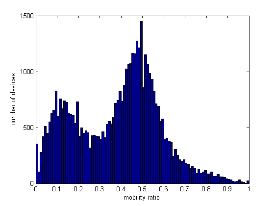
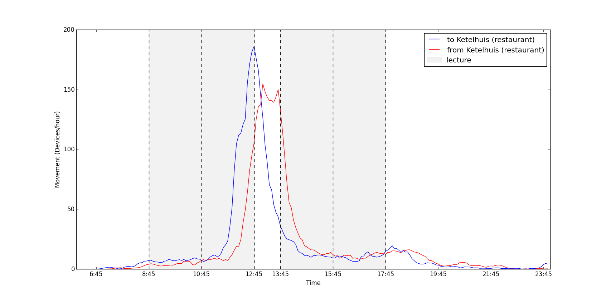

# Contents
{:.no_toc}

* Contents
{:toc}

# Introduction

Location is a key element of many processes and activities, and the
understanding of human movement behaviour is becoming increasingly
important. Knowledge of people’s locations and related mobility patterns
are important for numerous activities, such as urban planning, transport
planning and facility management. How to efficiently use the available
space, is a common problem in many fields. In the educational sector,
universities are struggling to meet the higher expectations of
facilities for education and research by students and academic staff.
Managing the campus of a university has become a complex and challenging
task, including the involvement of many stakeholders. Campus managers
are in need for evidence-based information to support their decision
making[^1]. This includes better location data to detect
activities, occupancy and usage of the infrastructure.

To understand the human motion behaviour many studies are conducted
based on data collection of GPS receivers. The Global Navigation
Satellite System (GNSS) is commonly used to track people in large scale
environments. Speck (2008)[^2] studied the movement of pedestrians in
city centres, where potential participants were asked to carry a GPS
receiver. However, the distribution of GPS devices to participants
limits the possibilities to collect location data at a large scale.
Furthermore, due to poor quality of received signals from satellites in
indoor environments, GPS receivers are not suitable in these conditions.
Technological developments in the acquisition of location data by smart
phones and the use of Wi-Fi networks, enables new opportunities to track
users.

Wireless Local Area Networks (WLAN) are widely used for indoor
positioning of mobile devices within this network. The use of the Wi-Fi
network to estimate the location of people is an attractive approach,
since Wi-Fi access points (AP) are often available in indoor
environments. Furthermore, smart phones are becoming essential in daily
life, making it convincing to track mobile devices. This provides a
platform to track people by using WLAN as a sensor network, and study
the mobility of users inside buildings or groups of buildings.

At Delft University of Technology (TU Delft) a large scale Wi-Fi network
is deployed across all facilities covering the indoor space of the
campus. The network is known as an international roaming service for
users in educational environments and is called the eduroam network. It
allows students and staff members from the university to use the
infrastructure throughout the campus for free. This enables the
possibility to collect Wi-Fi logs, including individual scans of mobile
devices, at a large scale. A continuous collection of re-locations of
devices to access points for a long duration will return detailed
records of people’s movement. This ubiquitous and individual
georeferenced data derived from smart phones will present valuable
knowledge about the movement on the campus. Several work has been made
for studying human mobility patterns in a University’s campus.
Menses and Moreira (2012)[^3] used the eduroam network to study connectivity between
two places, by computing the number of movements between two places
within a given observation time period. Previous work has also been made
at TU Delft[^4], where several Wi-Fi monitors were placed
to detect occupation and movement between different faculties.

In this paper, we attempt to identify people’s movement patterns from
the eduroam network of TU Delft. Other than previous studies, this
research-driven project analysed data from more than 30.000 users, and
tries to detect movement patterns between buildings, and between large
indoor regions. The project is carried out in request of the
university’s department of Facility Management and Real Estate (FMRE).
With this project, we try to illustrate to what extend movement patterns
in and between buildings can be identified from anonymised Wi-Fi logs.
Firstly, individual states are extracted from the Wi-Fi logs, where
users stay for a longer time period. Secondly, movements are detected
between a sequence of states. Thirdly, movement patterns can be
identified by counting the amount of movement from, to or between
certain locations at different time intervals.

The aim of this paper is not to improve a Wi-Fi based positioning
technique, but to use the location data to conduct a mobility analysis
producing knowledge about the University’s campus. Based on the three
steps mentioned above, the aim of this project is to provide a method to
detect movement patterns from anonymised Wi-Fi logs. This includes the
separation of mobile devices (i.e. smart phones) and static devices
(e.g. laptops) from the Wi-Fi logs, and detecting movement to and from
beyond the spatial extent of the eduroam network by introducing the
concept of a ‘world’ state. Hereby, this paper attempts to contribute
with a method to automatically mine people’s movement patterns at two
spatial levels. First, movement at building level is analysed.
Subsequently, indoor movement at building-part level is studied, by
constructing a network graph of the underlying building floorplan. The
structure of this paper is as follows. Section *Case description*, describes the case study of TU
Delft, the tracking technique and the acquired data that is used in the
study. In section *Methodology* we present our methodology. Section *Results* discusses the obtained results.
Finally, in section *Conclusion and Recommendations*, we present our concluding remarks and recommendations.

## Case description

The project’s main area of interest is the campus of Delft University of
Technology (TU Delft), used by more than 30.000 students and staff
members. The eduroam network of the TU Delft campus consists of 1730
access points, distributed over more than 30 buildings, covering all
indoor space. Even large outdoor areas around the buildings have access
to the Wi-Fi network, because of the range of APs. Connection to the
Wi-Fi eduroam network is free of charge and requires only a NetID (i.e.
username and password), which all students and staff get upon
registration at the university. Every time a user accesses the network,
the connection is logged. When the connected device moves from one AP to
another, a new log is done. The location of the AP a mobile device is
connected to, will give an estimation of the mobile devices’ location,
and thus the person. This allows the tracking of devices in space and
time by relating buildings and building-parts to an aggregation of APs.

The data is collected for every single AP over a period of almost two
months. The logs are stored in a database on a virtual server at regular
intervals of 5 minutes. In order to ensure privacy, MAC addresses and
NetIDs (i.e. usernames) are hashed. Every log is stored with a start
time, session duration, AP name and a description of the AP’s location
(e.g. System Campus &gt; 20-Aula &gt; 2nd floor). The AP name always
contains the ID of the building it is located in. We can use this ID to
locate APs at building level. For the Faculty of Architecture and the
Built Environment, we also had information about the exact physical
position of each AP. This geo-referenced information is used to analyse
movement at building-part level.

[^1]:Heijer den, Alexandra (2012). “Managing the University Campus: Exploring models for the future and supporting today’s decisions”.
[^2]:Spek, SC van der (2008). “Mapping Pedestrian Movement: Using Tracking Technologies in Koblenz”. In: Lecture Notes in Geoinformation and Cartography, pp. 95–118.
[^3]:Meneses, Filipe and Alberto Moreira (2012). “Large scale movement analysis from WiFi based location data”. In: Indoor Positioning and Indoor Navigation (IPIN), 2012 International Conference on. IEEE, pp. 1–9.
[^4]:Kalogianni, E et al. (2015). “Passive WiFi Monitoring of the Rhythm of the Campus”. In: Proceedings of The 18th AGILE International Conference on Geographic Information Science. AGILE, pp. 1–4.

# Methodology

In this section the data mining methods used to retrieve movement
patterns from the Wi-Fi log at two different spatial levels will be
described. Figure 1 gives an overview of the main workflow, starting with the TU
Delft eduroam Wi-Fi log and ending with movement patterns. The two
spatial levels for which movement patterns will be derived are
’building’ and ’building-part’ level. The movement patterns on building
level concern the movement from, to and between the buildings on the
campus. The movement patterns on building-part level concern the
movement from, to and between building-parts of the faculty of
Architecture and the Built Environment. First subsection *Mobile device extraction* will describe the
extraction of mobile devices. The reason that mobile devices are
extracted is that the records of mobile devices (e.g. smart phones) are
more complete and representative for the actual movement of the
corresponding person then records of static devices (e.g. laptops). Subsection *Preprocessing raw Wi-Fi log sessions* will
describe how the raw data of the Wi-Fi log is preprocessed to retrieve
clean sessions for both building and building-part level. A session is
defined as time interval during which a device is connected to one
access point (AP). In subsection *State extraction* it will be explained how states are created by
grouping subsequent sessions that share the same location. A state is
defined as a time interval during which a device is located in a certain
building or building-part. A key part in the process of state extraction
is the creation of a ’world’ state which allows the detection of
movement from and to campus. Subsection *Movement extraction* addresses how the resulting states are used
to retrieve movements at both spatial levels. A movement is defined by
the change from one state to the next subsequent state, where the
different states must be at a different locations. Finally subsecton *Movement pattern extraction* describes how
the movements are used to derive and visualize movement patterns.

{: style="text-align: center;"}

*Figure 1: Workflow*
{: style="color:gray; font-size: 80%; text-align: center;"}

## Mobile device extraction

The Wi-Fi log contains data of different device types, as any device
that makes a connection to eduroam will be stored in the log. A
distinction can be made between mobile and static devices. Mobile
devices, such as smart phones, are usually switched on during the entire
day and are usually carried by the user. Static devices, such as
laptops, are mostly only switched on during particular periods when a
person is stationary for a longer period of time. Furthermore, they are
likely to be left by the user for certain time periods. Therefore, the
tracking of mobile devices gives more accurate information about the
patterns of users than the tracking of static devices. As a result a
distinction should be made between the two device types, so that static
devices can be filtered out. This distinction can be made based on the
knowledge that mobile device are more likely to have very short sessions
in the log as they continuously connect to new APs when a person moves
around. As a result the mobility of a device can be defined by the ratio
between the amount of short, 5 minute, sessions in the Wi-Fi log and the
total amount of sessions in the Wi-Fi log.

$$
\begin{align*}
Mobility\ ratio = \frac{number\ of\ short\ sessions}{total\ number\ of\ sessions}
\end{align*}
$$

Figure 2 shows a histogram of the mobility ratio of all devices. The two
distinctive peaks corresponding to the static and mobile devices can
clearly be identified. The mobility ration of all devices is stored in a
separate table, enabling filtering out of static devices at any point
during the process.

{: style="text-align: center;"}

*Figure 2: Histogram of mobility ratio of all devices in the Wi-Fi log.*
{: style="color:gray; font-size: 80%; text-align: center;"}

## Preprocessing raw Wi-Fi log sessions

For each session in the Wi-Fi log the name of the access point is
stored. By linking this name to a location the data becomes valuable for
detecting movement patterns. For some APs however the location is
unknown, these are filtered out. The other records are related to a
location, both on building and on building-part level. For building
level the location can easily be retrieved as the building ID is part of
the AP name. These IDs are linked to the corresponding building polygons
of a topographical map. The location of each building is the center
point of these polygons. For the Faculty of Architecture and the Built
Environment the floor plan with the locations of the different APs is
available. Building-parts ( see ) are defined based on the layout of the
APs. Each building-part contains several APs and the relation between
them is stored in the database. In this way the AP name can directly be
linked to a location.

## State extraction

To create states, subsequent sessions at the same location are grouped
together. As the location is known for each session on both building and
building-part level, states can be created for both spatial levels.
illustrates how sessions are grouped to create states. For grouping, a
time threshold of one hour is used, meaning that subsequent sessions
between which the time gap is less than one hour are grouped together.
The reason for the one hour threshold is that gaps smaller than an hour
are likely to represent a person that was just smoking or lunching
outside for a short period of disconnection. If a person is not recorded
for more than an hour it is more likely that the person has left the
campus. To be able to retrieve this movement away from and back to the
campus, ’world’ states are added to the data during a time period where
the person has not been recorded for more than one hour (see ). Finally,
states are present in the data that do not represent real visits, but
only people passing by a building. These short states are filtered out
(see Fig. 3).

{: style="text-align: center;"}

*Figure 3: Processing steps; from raw data to movements.*
{: style="color:gray; font-size: 80%; text-align: center;"}

## Movement extraction

The extracted states contain implicit information on the movement of the
device. If a device is first located at location A and subsequently at
location B it must have moved from location A to B. However, in order to
be able to retrieve movement patterns, the movement should be stored
explicitly. The origin and destination of the movement are defined by
the locations of both states. The timing of the movement is derived by
taking the end time of each state minus 5 minutes and the start time of
the subsequent state (see Fig. 3). The reason for the 5 minute subtraction, is
that the last moment a device is actually recorded is 5 minutes before
the end time of a state.

## Movement pattern extraction

The final step is to extract movement patterns from the created
movements. These patterns can be derived by counting the amount of
movement from, to or between certain buildings and building-parts for
different time intervals. To determine if a movement should be counted
for a particular time interval, it is checked whether the time between
start and end falls within the interval. In this way each movement can
only be counted ones when comparing adjacent intervals. The amount
movement is both visualized in time profiles and maps with specified
time intervals. To visualize the indoor movement on a map, a network
graph of the underlying building floor plan is created for the Faculty
of Architecture and the Built Environment. For building level, no graph
is created as the movement in outdoor space is less constrained,
especially considering the spacious character of the TU Delft campus. To
determine the route taken from one building-part to another the shortest
path is taken using the Dijkstra algorithm.

{: style="text-align: center;"}

*Figure 4: Building parts on the ground floor of the Faculty of Architecture and the built environment and its underlying graph.*
{: style="color:gray; font-size: 80%; text-align: center;"}

# Results

First will give a brief analysis of the data, including some general
statistics. In the remainder of the chapter several movement patterns
retrieved from the raw Wi-Fi log will be presented. It should be noted
that many different movement patterns can be identified by counting the
movement for different time intervals and for different routes. This
paper aims at giving an overview of the different patterns that can be
extracted. will present the outdoor building level patterns, and the
indoor building-part level patterns.

## General statistics

Within the dataset 44.952 different users are present that together have
86.413 devices. Of these devices 24.156 are classified as mobile, the
remaining devices are either classified as static or had less than 100
sessions in the Wi-Fi log, which was decided to be insufficient for
classification. The 100 record threshold is a point of discussion,
currently it is based on the reasoning that a person that has less
records, is likely to be a visitor with access to eduroam, and not a
regular user of the TU Delft campus. shows the amount of data during the
different processing steps for both spatial levels. The reduction from
session to states is mainly due to the grouping. The reduction from
states to movements is mainly because the devices with less than 100
records are filtered out at this point.

{: style="text-align: center;"}

*Amount of data during processing stages*
{: style="color:gray; font-size: 80%; text-align: center;"}

## Outdoor movement patterns

Looking at building level, movement patterns between, from and to
buildings can be detected. shows the time profile of all movements with
and without the ‘world’ state. This graph shows that there is much
movement around 8.45, 12.45, 13.45, 15.45 and 17.45, corresponding with
lecture hours at TU Delft. With ‘world’ (blue line), the morning and
evening rush hours around 8.45 and 17.45 are detected, when students and
staff travel between campus and, probably, home. Without introducing the
‘world’ state (red line), these two movement peaks are not detected.

{: style="text-align: center;"}

*Time profile of indoor movement without world (only between building-parts) and with world (including movement from and to building part from ’world’.)*
{: style="color:gray; font-size: 80%; text-align: center;"}

illustrates the ten most occurring movements between buildings, on a
map, where buildings are represented as nodes, and edges represent the
number of movements. The number of movement, during the observation
period, is illustrated with colour and line width.

{: style="text-align: center;"}

*Top 10 most occuring movements on building level.*
{: style="color:gray; font-size: 80%; text-align: center;"}

In the movements of mobile (blue) and static (red) devices are shown.
The time profile of static devices, compared with lecture hours, is less
explicit than for mobile devices. This supports the assumption that
movement of static devices is less related to movement of people, than
mobile devices. Therefore, in this paper we only analyse movement of
mobile devices, to provide knowledge about human movement behaviour.

{: style="text-align: center;"}

*Time profile of all outdoor movement for static and mobile devices.*
{: style="color:gray; font-size: 80%; text-align: center;"}

The previous figures showed the movement over the entire time span of
the research. However, different movement patterns can be identified by
querying the data for certain time intervals. gives the time profiles of
the movement of mobile devices during weekdays and weekends for all
buildings including ’world’. Usually, most building at the TU Delft
Campus, except for the library, are closed during the weekend. This is
reflected by the amount of movement during the weekend. Moreover,
compared to weekdays, the number of movement is constant throughout the
day, as there are no lectures.

{: style="text-align: center;"}

*Time profile of all outdoor movement of mobile devices for week- and weekend days.*
{: style="color:gray; font-size: 80%; text-align: center;"}

Finally, the movement can also be queried based on origin and
destination instead of or together with time. This enables a more
detailed analysis of specific buildings or events. shows the movement
from and to the Aula during normal weekdays. The Aula has a lunch
facility, explaining the large amount of movement during lunch time.
Both the movement to and from the Aula is high at the start and the end
of the lunch time, because other facilities are located in the Aula as
well. gives insight in where people exactly come from and go to, during
the interval between 13:15 and 14:00. As expected, many people move to
the library at this time, probably to continue studying after lunch.

{: style="text-align: center;"}

*Time profile of movement of mobile devices from and to aula during normal weekdays.*
{: style="color:gray; font-size: 80%; text-align: center;"}

{: style="text-align: center;"}

*Movement of mobile devices from and to aula between 13:15 and 14:00 during normal weekdays.*
{: style="color:gray; font-size: 80%; text-align: center;"}

## Indoor movement patterns

Like for building level, the building-part level data can be filtered
for mobile devices and queried based on time, and origin and
destination. shows the time profiles for all movement on building-part
level for the Faculty of Architecture and the Built Environment. With
’world’ this includes the movement from and to the faculty, without
’world’ these movements are excluded. During the working day, the
movement is relatively steady, except for two distinct peaks before and
after lunch. Furthermore, small peaks can be seen at the start and end
of the day when people arrive and leave the building. The Faculty of
Architecture and the Built Environment normally closes at 22:00,
resulting in a movement peak captured in the graph.

{: style="text-align: center;"}

*Time profile of indoor movement without world (only between building-parts) and with world (including movement from and to building part from ’world’).*
{: style="color:gray; font-size: 80%; text-align: center;"}

shows all the movement within the Faculty of Architecture and the Built
Environment on a map. As the movements follow the shortest route on the
graph, it becomes possible to see which particular corridor or staircase
is busiest. Here the movement rates are highest in the eastern part of
the ground floor. This shows occupation of space by movement instead of
the flow between two states.

{: style="text-align: center;"}

*Map of all movement within the faculty of Architecture.*
{: style="color:gray; font-size: 80%; text-align: center;"}

Finally, and give a more detailed insight in the movement from and to
the Bouwpub (café) and canteen (lunch facility) building-parts. The time
profile of the canteen shows the expected peaks before and after lunch.
Simarly it can be seen that people move towards the bouwpub after
lecture time and leave around 20:00 when it closes.

{: style="text-align: center;"}

*All movement of mobile devices during weekdays from and to the bouwpub.*
{: style="color:gray; font-size: 80%; text-align: center;"}

{: style="text-align: center;"}

*All movement of mobile devices during weekdays from and to the canteen.*
{: style="color:gray; font-size: 80%; text-align: center;"}

Conclusion and Recommendations
==============================

To understand human motion behaviour for better decision making, many
studies have been conducted based on location data collection. Wi-Fi
tracking technology is increasingly used due its cost effectiveness and
ability to track people at a large scale. For this study, we used the
eduroam network of the TU Delft Campus to identify movement patterns.
Firstly, states are extracted from the raw Wi-Fi logs. Subsequently, the
event of going from one state to another can be detected as movement.
Finally, by counting the number of movement for an observation period,
movement patterns can be identified. This paper tried to illustrate to
what extend movement patterns in and between buildings can be identified
from anonymised Wi-Fi logs. We successfully identified movement patterns
at two spatial levels.

At building level, the rhythm of the campus is illustrated by time
profiles showing the amount of movement for different observation
periods. We found that movement at the campus was related to the lecture
hours. Flow and direction of aggregated movement can be visualized on a
map as edges. At building-part level, similar movement patterns can be
identified. An indoor network graph was created of the underlying
building floorplan. This successfully illustrates the occupied space for
movement. However, the range of APs can extent between building-parts
and floors and limits the accuracy of the analysis.

It is possible to identify movement patterns in and between buildings
using the eduroam network. The presented method automatically mines
movement patterns of large crowds from a dataset with anonymised Wi-Fi
logs. However, we also encountered limitations from which several
recommendations can be provided for future implementations.

The movement trajectory between two building-part states is computed
with a shortest path algorithm, using the constructed network graph.
Better models need to be implemented for a more accurate path
estimation. No data from APs on the way between two states is used to
estimate the path, because the system stores logs at a 5-minute
interval. With a shorter log interval, this can be considered. The
Faculty of Architecture and the Built Environment has a building lay-out
with separate building wings and only three floor levels. It is
important to mention that this building lay-out makes it easier to
distinguish between building parts. Considering the range of APs,
different methods need to be investigated for buildings with more floor
levels. This also means that for the identification of movement at room
level, other techniques, e.g. including Received Signal Strength (RSS),
need to be implemented. In this paper, the road network is not used to
estimate a detailed path of outdoor movement between building states.
Due to the spacious character of the TU Delft campus and limited
constrained space for pedestrians, it is challenging to analyse the
usage of the infrastructure. With several strategically placed APs
outdoor and logging with a higher frequency, this can be considered.
Detailed information about the usage of the infrastructure on the campus
can provide valuable knowledge, such as the identification of hotspots
at specific time periods.

*Text written by Simon Griffioen and Martijn Vermeer*

# References

